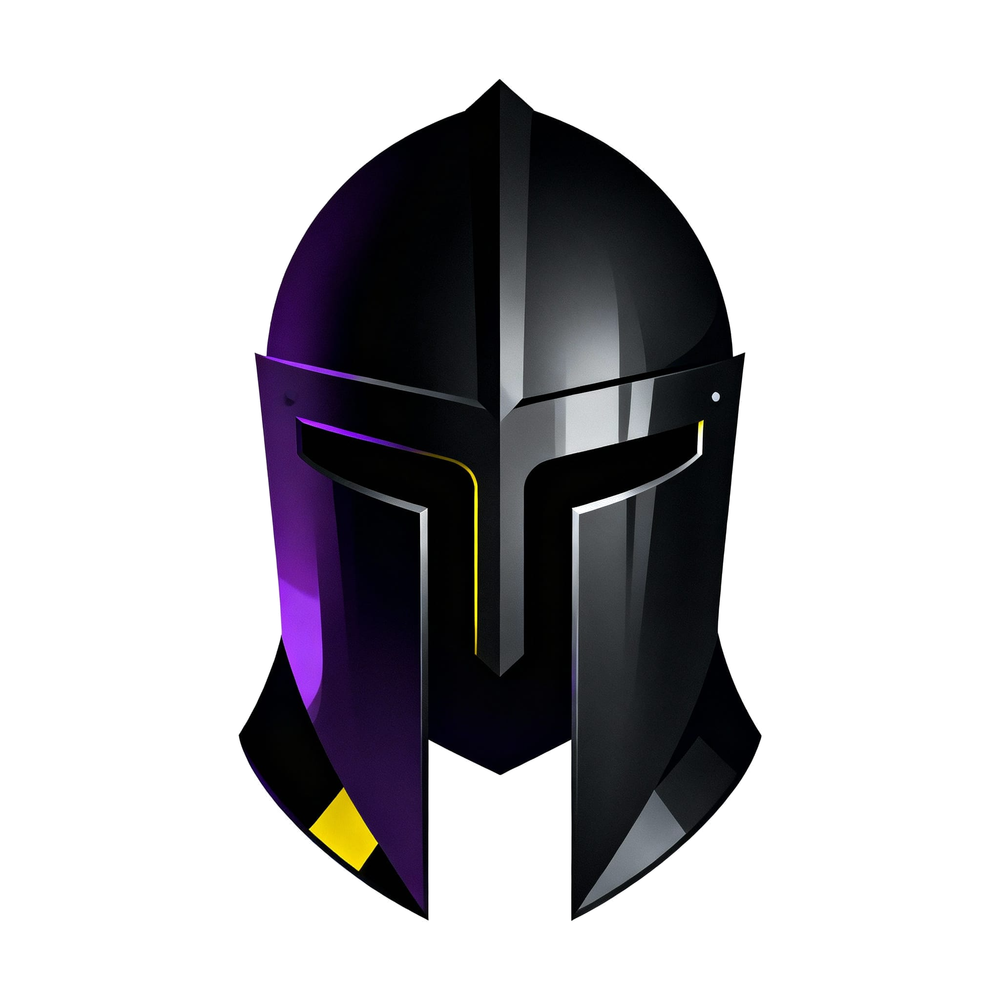

<div align="center">



# Tengil

> *"All makt åt Tengil, vår befriare!"*

**Declarative infrastructure for Proxmox homelabs**

One YAML file. Storage + containers + shares.

[]()
[]()
[]()
[]()

⚠️ **Beta Status:** Storage + shares production-ready. Container auto-creation experimental. [See status](#feature-status)

[Quick Start](#quick-start-2-minutes) •
[Packages](#available-packages) •
[Docs](docs/USER_GUIDE.md) •
[Examples](#configuration-example)

</div>

---

## What is Tengil?

**Infrastructure-as-code for Proxmox homelabs.** Get TrueNAS SCALE-like simplicity for storage + apps **without replacing your OS**.

```yaml
# tengil.yml
pools:
  tank:
    datasets:
      media:
        profile: media              # ← ZFS optimized (1MB recordsize, lz4)
        containers:
          - name: jellyfin
            auto_create: true
            mount: /media
        shares:
          smb: Media               # ← Samba share
```

```bash
tg diff   # See what will change
tg apply  # Make it happen
```

**Result**: Storage + Jellyfin + share running in 2 commands.

---

## Why Tengil?

**You chose Proxmox for flexibility.** Now get TrueNAS-like simplicity for storage + apps.

<table>
<tr>
<th>Manual Proxmox</th>
<th>Tengil</th>
</tr>
<tr>
<td>

```bash
# 30+ minutes, 15+ commands
zfs create tank/media
zfs set recordsize=1M tank/media
zfs set compression=lz4 tank/media
pvesm add zfspool tank-media ...
nano /etc/samba/smb.conf
# ... (more manual config)
```

</td>
<td>

```yaml
# 2 minutes, 2 commands
media:
  profile: media
  shares:
    smb: Media
```

```bash
tg apply
```

</td>
</tr>
</table>

### Key Benefits

- ✅ **Reproducible**: `git commit tengil.yml` → restore anywhere
- ✅ **Optimized**: ZFS profiles auto-tuned for media/databases/downloads
- ✅ **Unified**: Storage + containers + shares in one place
- ✅ **Safe**: Preview changes with `tg diff` before applying
- ✅ **Trackable**: State stored in `.tengil.state.json`

---

## Quick Start (2 Minutes)

### Installation

**From your Mac/Workstation** (installs to Proxmox remotely):

```bash
git clone https://github.com/androidand/tengil.git
cd tengil

# Install from GitHub
./scripts/install.sh root@YOUR-PROXMOX-IP

# Or install your local development version
./scripts/install.sh root@YOUR-PROXMOX-IP --local
```

**Or directly on Proxmox**:

```bash
# SSH to Proxmox first, then:
curl -fsSL https://raw.githubusercontent.com/androidand/tengil/main/scripts/install.sh | sudo bash
```

### First Deploy

```bash
# Browse preset packages
tg packages list

# Create config from preset
cd ~/tengil-configs
tg init --package nas-basic

# Preview changes
tg diff

# Apply
tg apply
```

**Result**: ZFS datasets + SMB shares ready to use.

### Recommended Git Workflow

Tengil works best when your config lives in Git:

```bash
cd ~/tengil-configs
tg repo init --path .          # Initialize Git repo + .gitignore
git add tengil.yml
git commit -m "Initial Tengil config"

# Typical daily flow
tg scan                         # capture current reality snapshot
$EDITOR tengil.yml              # make changes
git commit -am "Add jellyfin datasets"
tg verify                      # validate config + host resources
tg plan                         # alias of tg diff
tg apply                        # apply with drift safeguards
tg status                       # remind yourself to commit before apply
git push
```

Run `tg scan` whenever you change things in the Proxmox GUI so drift reports stay accurate.

📖 **[Full Installation Guide](docs/USER_GUIDE.md#installation)** - Multiple install modes, SSH setup, troubleshooting  
📖 **[Mac/Windows Mounting](docs/USER_GUIDE.md#accessing-shares-from-mac)** - Connect to your shares

---

## Docker Compose Integration

Tengil uses upstream Docker Compose files as source of truth + adds ZFS storage optimization:

```bash
# Use curated compose files
tg init --package ai-workstation  # Ollama + Jupyter from compose_cache/

# Or analyze any compose file
tg compose analyze ./docker-compose.yml

# Tengil adds:
# - ZFS recordsize optimization (1M for media, 8K for databases)
# - Unified permissions (container + SMB share same data)
# - SMB/NFS share generation
# - LXC container management
```

**Resolution chain**: cache → upstream URL → generate from image → dockerfile

**Cached apps**: ollama, jupyter, jellyfin, immich, nextcloud

See [USER_GUIDE.md](docs/USER_GUIDE.md#docker-compose-integration) for details.

---

## Available Packages

**Storage** (Simple NAS):
- `nas-basic` - Samba shares only
- `nas-complete` - NAS + Nextcloud + Immich

**Media**:
- `media-server` - Jellyfin + organized media
- `download-station` - qBittorrent + *arr stack (Sonarr, Radarr, Prowlarr)

**Development**:
- `ai-workstation` - Ollama + Jupyter + GPU support
- `devops-playground` - Gitea + CI/CD + monitoring

**Automation**:
- `home-automation` - Home Assistant + Node-RED + MQTT

**Network**:
- `remote-access` - WireGuard + nginx-proxy + Authelia
- `privacy-fortress` - Pi-hole + Vaultwarden + CrowdSec

**Collaboration**:
- `family-hub` - Shared calendars + tasks + recipes + photos

**Gaming**:
- `gaming-station` - ROM storage + game streaming
- `rom-manager-compose` - romM (Docker Compose integration example)

---

## What Makes Tengil Different

### 1. Storage-First Philosophy

**Most tools**: "Container needs 50GB" → allocate generic volume

**Tengil**: "Media needs 1MB recordsize for sequential reads" → optimize storage first

```yaml
datasets:
  media:
    profile: media  # recordsize=1M, compression=lz4, atime=off
    consumers:
      - container: jellyfin
        mount: /media
      - share: smb/Media
# Tengil handles: ZFS props, mount flags, Samba config, permissions
```

**Real impact**:
- 30% faster sequential reads (optimized recordsize)
- 3-4x space savings for code repos (heavy compression)
- Automatic permission management across containers + shares

### 2. Unified Permissions

**The pain**: "Jellyfin reads `/media`, SMB share writes to it, Immich also needs access"

Manually: Configure ZFS ACLs, pct mount flags, Samba permissions, user mappings.

**Tengil**: Just declare consumers, permissions handled automatically.

### 3. Terraform-lite Workflow

```bash
tg diff      # Plan: see what will change
tg apply     # Apply: make it happen
tg rollback  # Undo: restore from checkpoint
```

State tracked in `.tengil.state.json`. Version control with git.

### 4. Docker Compose Integration

Use upstream compose files + add Tengil's storage optimization:

```yaml
# Reference upstream + add hints (50 lines)

docker_compose:
  cache: "compose_cache/immich/docker-compose.yml"  # Curated
  source: "https://github.com/.../docker-compose.yml"  # Fallback

storage_hints:
  "/photos":
    profile: media
    size_estimate: "2TB"
```

**Why this matters**:
- ✅ Upstream maintains compose (not you)
- ✅ Tengil adds ZFS optimization (what compose can't do)
- ✅ Minimal YAML to write
- ✅ Works with any Docker Compose app

---

## What Tengil Manages

### ✅ Handles

**Storage**:
- ZFS dataset creation with optimized properties
- Proxmox storage registration
- Dataset profiles (media, dev, backups, docker)

**Compute**:
- LXC container creation from templates
- Container resource allocation (CPU, RAM)
- Container lifecycle (start/stop)
- Template auto-download

**Integration**:
- Bind mount configuration (dataset → container)
- Samba/NFS share setup
- Docker + Portainer installation
- Docker Compose deployment

**Operations**:
- State tracking (what Tengil created)
- Diff preview (see changes before apply)
- Automatic checkpoints (recovery snapshots)
- Idempotent operations (safe to re-run)

### ❌ Doesn't Handle

- **VMs**: LXC only (use Proxmox UI for VMs)
- **Networking**: Firewalls, VLANs (use Proxmox UI)
- **App config**: Jellyfin settings, Sonarr indexers (use app web UI)
- **Backups**: Snapshot scheduling (use Proxmox Backup Server)
- **Multi-server**: Clustering, HA (use Ansible)

**Tengil's sweet spot**: Infrastructure layer (storage + compute + connectivity)

---

## CLI Reference

**Core Commands:**
```bash
tg packages list           # Browse 13 preset packages
tg init --package X        # Generate tengil.yml
tg plan                    # Alias of diff (terraform plan naming)
tg diff                    # Preview changes (terraform plan)
tg apply                   # Deploy to Proxmox (terraform apply)
```

**Hybrid (GUI + YAML) workflows:**
```bash
tg scan                    # Capture current reality snapshot (ZFS + containers)
tg diff                    # Show plan plus drift summary vs. last scan
tg apply --prefer-gui      # Apply YAML but keep GUI changes (update desired state)
tg apply --no-drift-auto-merge  # Force confirmations for every drift item
```

Auto-created containers also undergo a resource sanity check: `tg diff`/`tg apply` warn (or abort) if requested RAM/cores exceed the host capacity detected from Proxmox.

**Container Management:**
```bash
tg container exec jellyfin ls /media    # Execute commands in containers
tg container shell jellyfin             # Open interactive shell
tg container update jellyfin            # Update packages (apt update && upgrade)
tg container start/stop/restart jellyfin  # Lifecycle management
```

**Docker Compose Integration:**
```bash
tg compose analyze ./docker-compose.yml # Analyze compose files
tg compose validate ./compose.yml       # Validate for Tengil compatibility
tg compose resolve immich               # Test package compose resolution
```

**App Repository Management:**
```bash
tg app sync jellyfin https://github.com/user/config  # Sync git repos to containers
tg app list jellyfin                                  # List app manifests
```

**Discovery & Analysis:**
```bash
tg discover --containers               # List LXC containers
tg discover --docker-containers        # List Docker containers
tg discover datasets --pool tank       # Discover existing ZFS datasets
tg doctor                              # System hardware/software info
```

**Infrastructure Management:**
```bash
tg import tank                         # Import existing infrastructure
tg snapshot --name backup              # Create ZFS snapshots
tg rollback dataset --to snapshot      # Rollback to snapshot
tg suggest media                       # Suggest containers for dataset types
```

**25+ commands available across 8 command groups:** packages, init, diff, apply, container, app, compose, discover, import, snapshot, rollback, suggest, install, templates, doctor, version

📖 **[Complete CLI Reference →](docs/USER_GUIDE.md#configuration)** - All commands, flags, and examples

---

## Configuration Example

**Simple media server:**

```yaml
pools:
  tank:
    datasets:
      media:
        profile: media              # 1M recordsize for video files
        containers:
          - name: jellyfin
            auto_create: true
            template: debian-12-standard
            mount: /media
            readonly: true          # Safety: prevent accidental deletion
            memory: 4096
            cores: 2
            post_install: tteck/jellyfin  # Auto-install Jellyfin
        shares:
          smb:
            name: Media
            browseable: yes
```

**With Docker Compose:**

```yaml
pools:
  tank:
    datasets:
      photos:
        profile: media
        containers:
          - name: immich
            auto_create: true
            mount: /photos

containers:
  immich:
    memory: 8192
    cores: 4
    docker_compose:
      cache: "compose_cache/immich/docker-compose.yml"
      image: "ghcr.io/immich-app/immich-server:release"  # Fallback

storage_hints:
  "/photos":
    profile: media
    size_estimate: "2TB"
```

📖 **[More Examples →](docs/USER_GUIDE.md#configuration)** - Multi-pool, containers, profiles, customization

---

## Feature Status

**✅ Production Ready**:
- ZFS dataset management
- Proxmox storage integration
- Samba/NFS shares
- Multi-pool support
- Docker Compose integration
- State tracking
- Profile system

**⚠️ Experimental** (test first):
- Container auto-creation
- Template auto-download
- Post-install scripts (Docker, Portainer, tteck)
- Docker Compose deployment to containers

**🚧 Planned**:
- State import (`tg import`)
- Pool analysis (`tg plan-pools`)
- Backup integration

---

## Production Readiness

**✅ Safe for production**: ZFS operations, mount management, share configuration

**⚠️ Test first**: Container auto-creation, Docker installation, compose deployment

**Safety**: Tengil creates but never destroys. Your data is safe.

📖 **[Troubleshooting Guide →](docs/USER_GUIDE.md#troubleshooting)** - Common errors, SSH issues, ZFS problems, rollback

---

## Requirements

- Proxmox VE 7.x, 8.x, or **9.1+ (with OCI support)**
- Python 3.10+
- ZFS pool (create once: `zpool create tank ...`)
- Root/sudo access
- **Optional**: skopeo (auto-installed for OCI containers on Proxmox 9.1+)

---

## OCI Container Support (Proxmox 9.1+)

**NEW:** Native OCI container support via Docker Hub, GHCR, and Quay.io

### Why OCI?
- ⚡ **5-7x faster** deployment (2 min vs 10-15 min traditional)
- 🐳 **Millions of images** available (Docker Hub, GHCR)
- 🔄 **Industry standard** - maintained by app vendors
- ✅ **GPU passthrough** - Hardware transcoding (Intel/NVIDIA)
- 📦 **Pre-built packages** - Jellyfin, Immich, Home Assistant, Nextcloud

### Implementation Approach

Tengil uses **direct CLI commands** (not Web UI APIs):

```python
# Our approach: Direct subprocess calls
subprocess.run(['skopeo', 'copy', 'docker://...', 'oci-archive:/path'])
subprocess.run(['pct', 'create', '200', 'local:vztmpl/image.tar'])
```

**Why CLI?**
- ✅ More reliable (no HTTP/auth overhead)
- ✅ Faster (direct execution)
- ✅ Simpler (no HTTP dependencies)
- ✅ Standard (Proxmox Web UI uses same commands)
- ✅ Tested on production (192.168.1.42, Proxmox 9.1.1)

### Usage

```yaml
# packages/jellyfin-oci.yml
name: jellyfin
type: oci

oci:
  image: jellyfin/jellyfin
  tag: latest
  registry: docker.io

cores: 4
memory: 4096
gpu:
  passthrough: true  # Hardware transcoding

mounts:
  - source: /tank/media
    target: /media
    readonly: true
```

```bash
tg apply packages/jellyfin-oci.yml  # Deploy in ~2 minutes
```

**Available OCI Packages:**
- `jellyfin-oci.yml` - Media server with GPU transcoding
- `homeassistant-oci.yml` - Home automation
- `nextcloud-oci.yml` - File sync & collaboration
- `immich-oci.yml` - Photo management (multi-container)

📖 **[OCI Research Docs →](docs/proxmox-oci-research.md)** - Implementation details, tested containers  
📖 **[Backend Architecture →](tengil/services/proxmox/backends/README.md)** - LXC vs OCI design

---

## Documentation

📖 **[Complete User Guide](docs/USER_GUIDE.md)** - Configuration reference, Docker Compose integration, troubleshooting

### Quick Links

- **Getting Started**: [Installation](docs/USER_GUIDE.md#installation) | [First Deploy](docs/USER_GUIDE.md#first-deploy---nas-shares)
- **Configuration**: [Single Pool](docs/USER_GUIDE.md#single-pool-setup) | [Multi Pool](docs/USER_GUIDE.md#multi-pool-setup) | [Profiles](docs/USER_GUIDE.md#built-in-profiles)
- **Tasks**: [Add Containers](docs/USER_GUIDE.md#adding-a-container-mount) | [Add Shares](docs/USER_GUIDE.md#adding-smb-share) | [Post-Install](docs/USER_GUIDE.md#post-install-automation)
- **Advanced**: [Docker Compose](docs/USER_GUIDE.md#docker-compose-integration) | [Troubleshooting](docs/USER_GUIDE.md#troubleshooting)

---

## License

MIT

## Credits

Named after Tengil from Astrid Lindgren's "The Brothers Lionheart" - who ruled with absolute control from his fortress.

> **"All makt åt Tengil, vår befriare!"**
> *("All power to Tengil, our liberator!")*

Like the tyrant who commanded Cherry Valley, this Tengil commands your homelab infrastructure from a single YAML file. The difference? This Tengil serves you.
